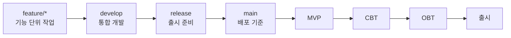
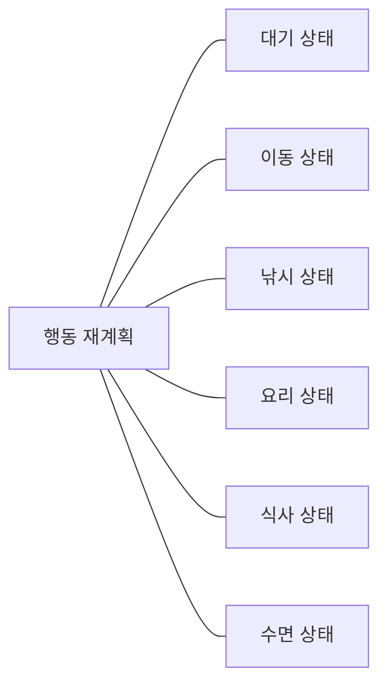
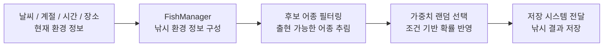
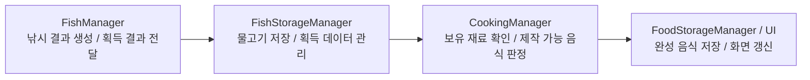
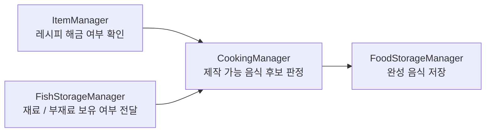
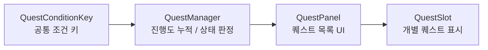

# 둥둥 아일랜드

창 크기와 호수 높이를 직접 조절할 수 있는  
데스크톱 위젯형 방치 게임

---

## 프로젝트 소개

둥둥 아일랜드는 곰 캐릭터가 상태값에 따라  
낚시, 식사, 수면, 요리, 판매를 반복하는  
데스크톱 위젯형 방치 게임입니다.

플레이어는 자율행동으로 얻은 자원을 활용해  
섬과 호수를 꾸미고, 퀘스트와 저장 시스템을 통해  
자신만의 작은 공간을 만들어갈 수 있습니다.

 
 
## Links

  
  &nbsp;
  

---

## 개발 정보

- **엔진** : Unity 6000.3.5f2
- **언어** : C#
- **형태** : 포트폴리오 프로젝트
- **플랫폼** : Windows PC
- **개발 기간** : 2026.02.09 ~ 2026.04.08
- **개발 인원** : 기획: 7명  개발: 5명
- **핵심 구현** :
  - 상태패턴 기반 자율행동 AI
  - 낚시 → 창고 → 요리 데이터 파이프라인
  - 저장 데이터와 UI 표시 순서 분리
  - 퀘스트 진행도 누적 구조
  - UI / VFX 연출 구현

---

## 브랜치 전략

- `main` : 배포 기준
- `release` : 출시 준비
- `develop` : 통합 개발
- `feature/*` : 기능 단위 작업
  
---

## 주요 기능

### 1. 자율행동 AI

상태값을 기준으로 다음 행동을 선택하도록 구성했습니다.

- Idle / Move / Fishing / Eat / Sleep / Cook 상태 분리
- 배고픔, 스태미나, 보유 자원 조건에 따라 행동 전환
- 예외 상황에서도 루프가 끊기지 않도록 생존 흐름 유지
 
---

---

### 2. 낚시 시스템

기본 행동 상태에서는 낚시를 반복 수행하며  
환경 조건에 따라 후보 어종을 선택합니다.

- 환경 정보를 기준으로 후보 어종을 추립니다
- 후보군에 가중치를 적용해 최종 어종을 선택합니다
- 선택된 결과는 저장 시스템으로 전달됩니다

---

### 3. 창고 시스템

물고기와 음식은 각각 별도 구조로 관리하고,  
데이터 변경이 화면에 안정적으로 반영되도록 구성했습니다.

- 물고기 / 음식 저장 구조 분리
- 획득 데이터와 제작 결과를 단계별로 전달
- 데이터 변경 시 UI 갱신 대응

---

### 4. 요리 시스템

인벤토리와 레시피 해금 상태를 기준으로  
제작 가능한 음식 후보를 판정하도록 만들었습니다.

- 재료 보유 여부 검사
- 레시피 해금 여부 확인
- 제작 가능한 음식 후보 선정
- 완성 음식은 별도 저장소에 보관

---

### 5. 퀘스트 시스템

퀘스트 진행도는 UI와 직접 연결하지 않고  
백그라운드에서 자동 누적되도록 구성했습니다.

- 조건 키 기반 진행도 누적
- 상태 판정과 UI 표시 분리
- 보상 수령 후 완료 처리

- **QuestConditionKey** : 퀘스트 진행 조건을 구분하는 공통 기준
- **QuestManager** : 진행도 누적, 상태 판정, 완료 처리 담당
- **QuestPanel / QuestSlot** : 누적된 결과를 UI에 표시

---

### 6. UI / VFX 연출

DOTween / Pooling 기반으로 상태 변화와 보상 획득을  
플레이어가 바로 이해할 수 있도록 시각적으로 표현했습니다.

- 상태 이모지 / 말풍선

- 낚시 바늘 연출

- 보상 수렴 이펙트

---

---

### Commit 메시지 규칙

- Feat : 새로운 기능 추가
- Fix : 버그 수정
- Design : UI 디자인 변경
- HOTFIX : 치명적인 에러 긴급 수정
- Comment : 주석 추가 / 변경
- Docs : 문서 수정
- Style : 코드 포맷팅, 세미콜론 누락 등 코드 변경 없는 수정
- Refactor : 코드 리팩토링
- Test : 테스트 코드 추가 / 수정
- Chore : 빌드 설정, 패키지 매니저 수정
- Rename : 파일 / 폴더명 수정 및 이동
- Remove : 파일 삭제만 수행한 경우

---

### 프로젝트 폴더 관리 방

- 0.Scripts : 기능별 스크립트 관리
- 1.Prefabs : 프리팹 리소스 관리
- 2.Scenes : 씬 파일 관리
- 3.Animations : 애니메이션 관련 파일 관리
- 4.Materials : 머티리얼 리소스 관리
- 6.DataTable : CSV / 데이터 테이블 관리
